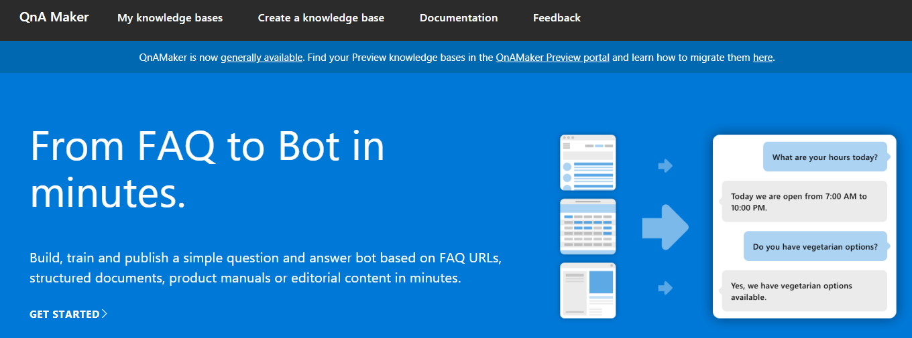

# QnA Maker ハンズオン

## QnA Maker とは

QnA Maker は、質問＆回答のリスト、または FAQ のような Web サイトから、Q&A を行う BOT をコーディングなしで自動生成できるサービスです。QnA Maker で作成した AI エンジンは、Web API 経由でアクセスして回答を得られる Web サービス として利用できるほか、Azure Bot Service のテンプレートとしても選択できるようになりました。
Q&A のリストを編集・追加も GUI の画面から行うことができます。

* [QnA Maker introduction on Cognitive Services Website](https://azure.microsoft.com/ja-jp/services/cognitive-services/qna-maker/)
* [QnA Maker Website](https://www.qnamaker.ai/)

&nbsp;

## ハンズオンのゴール

* QnA Maker を作成し、実際に触れて基本機能を理解する

## ハンズオン

[ここからハンズオンを始めましょう。](/get-started.md)
