# Q&A をコーディングなしで Bot 化！ Cognitive Services QnA Maker による Q&A Bot 作成

## FAQ サイト または リストからの Q&A Bot 作成

### 新規 Q&A Bot サービス の作成

QnA Maker のページ(https://www.qnamaker.ai/)にアクセスし、上部バーの [Create a knowledge base] をクリックし、ナレッジベースを作成します。

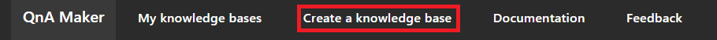

&nbsp;

#### STEP1

「Create a QnA service」をクリックすると Azure Portal が開き、 QnA Maker 作成画面が表示されます。

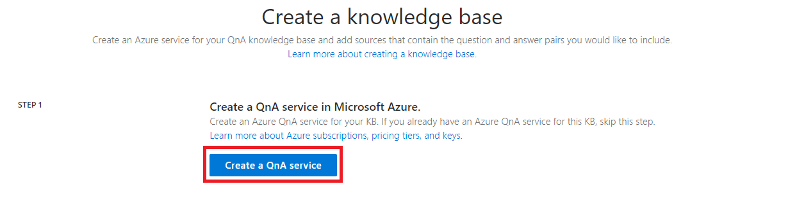

&nbsp;

Azure Portal の QnA Maker 作成画面で以下の情報を入力します。

* **Name**：任意の名前を入力
* **サブスクリプション**：（自動入力）
* **Management pricing tier**：F0（無料版）
* **Resource group**：新規作成 or 既に作成済みの任意のグループを選択
* **Search pricing tier**：F（無料版）
* **Search location**：お好みの Azure データセンターの拠点を選択
* **App name**：任意の名前（Name の値が自動で入力されます）
* **Website location**：お好みの Azure データセンターの拠点を選択
* **App insights**：Enable
* **App insights location**：お好みの Azure データセンターの拠点を選択

[作成] をクリックすると、サービスが作成されます。

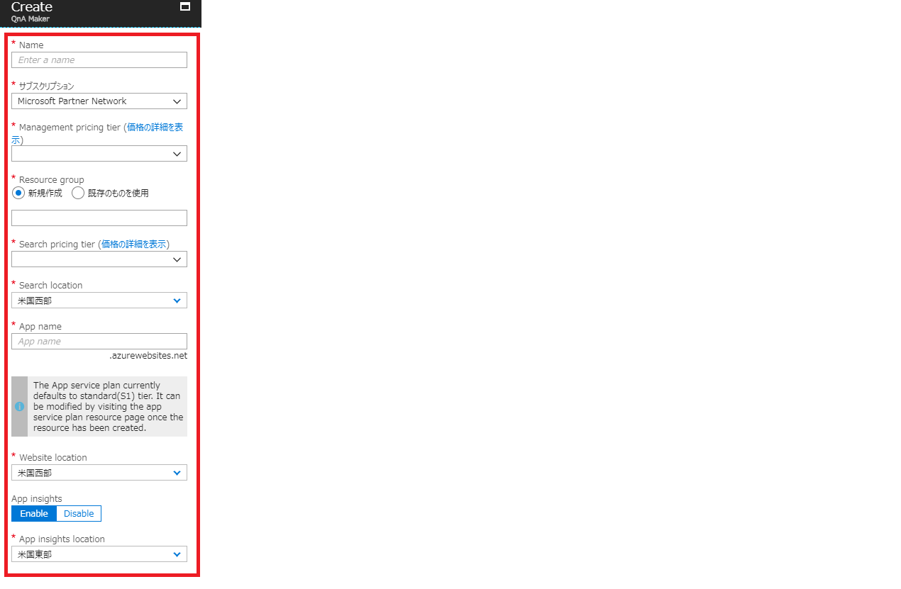

&nbsp;

#### STEP2

Azure Portal で Qna Maker の作成が完了したら、QnA Maker の [Create a knowledge base] にもどり、STEP2 で以下の情報を入力します。
※Qna Maker の作成完了は Azure Portal の画面右上に通知で表示されます。
※QnA Maker のページをリロードすると作成した Qna Maker が選択できるようになります。

* Microsoft Azure Directory ID：ご利用の ID
* Azure subscription name：ご利用のサブスクリプション
* Azure QnA service：作成した Qna Maker

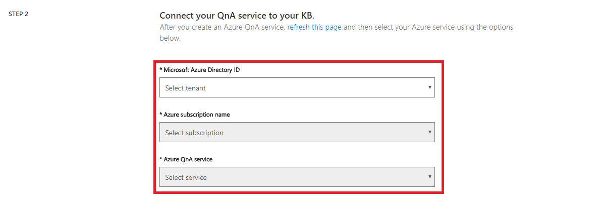

&nbsp;

#### STEP3

ナレッジベースに名前をつけます。任意の名前を入力します。

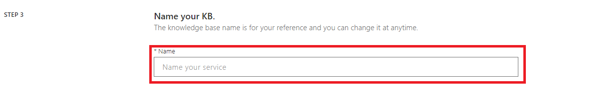

&nbsp;

#### STEP4

QnA Maker に FAQ データを追加します。
FAQ サイト、Q&A を記載したファイルをアップロードすることができます。今回のハンズオンでは、以下の URL (Azure サポートに関する FAQ ページ)を入力します。

```html
https://azure.microsoft.com/ja-jp/support/faq/
```

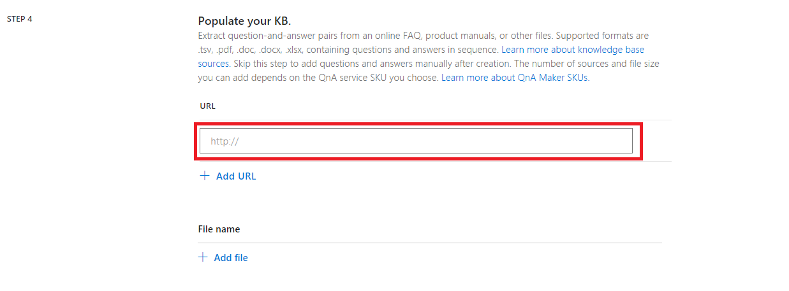

&nbsp;

#### STEP5

「Create your KB」をクリックしナレッジベースを作成します。

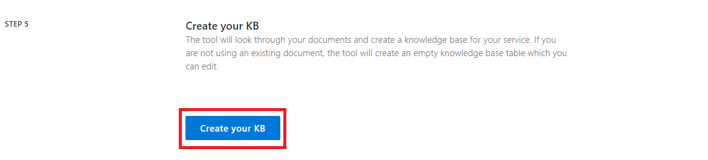

&nbsp;

ナレッジベースの作成が完了すると、ナレッジベースの編集ページが開きます。ナレッジベース編集画面では QA の編集や、追加、削除を行うことができます。

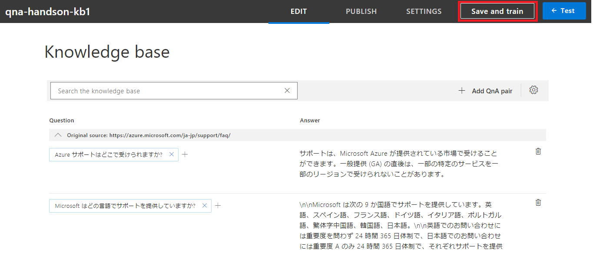

&nbsp;

STEP4 で入力した [Azure サポートに関する FAQ ページ](https://azure.microsoft.com/ja-jp/support/faq/)の中と見比べて正しくとりこまれているかを確認することができます。

QA を変更した場合は、画面右上の[Save and train]をクリックし、編集内容を保存し、QnA Maker モデルのトレーニングを行います。

## Q&A のテスト

画面右上の[← Test]をクリックすると、QA のテスト用のページが表示され、実際の QnA Maker の動作を確認できます。想定された質問を入力すると、ナレッジベースから適切な答えを Bot が返答します。

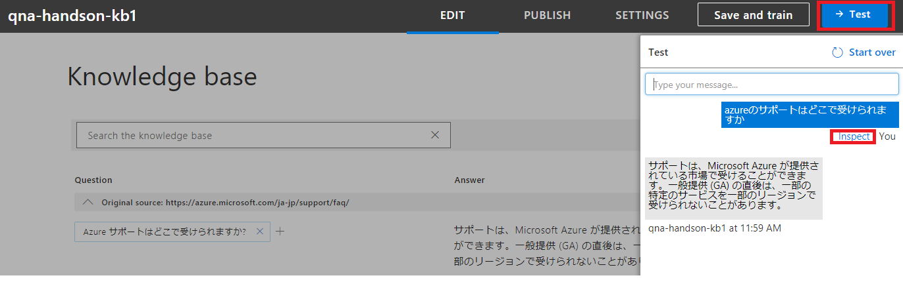

&nbsp;

[Inspect]をクリックすることで Bot の回答の詳細を確認することができます。

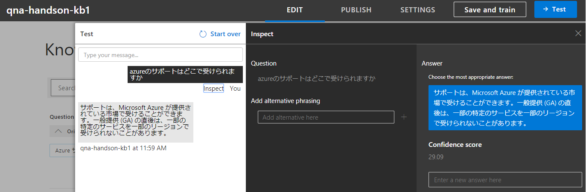

&nbsp;

## QnA Maker の Web 公開

[PUBLISH]をクリックすることでナレッジベースを Web に公開することができます。

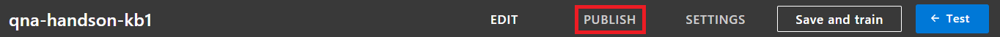

&nbsp;

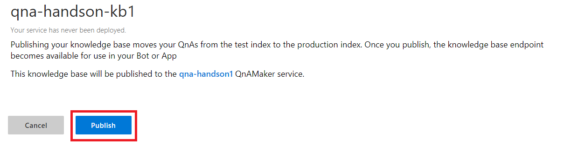

&nbsp;

QnA Maker サービスが正常に公開されると作成した QnA Maker のエンドポイントが表示されます。

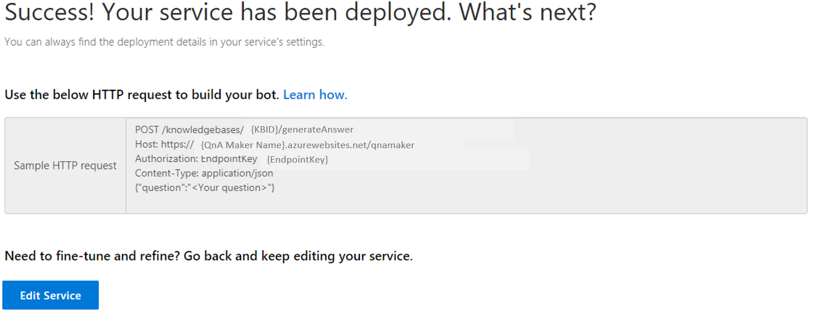

&nbsp;

## まとめ

質問＆回答のリスト、または FAQ などから Bot が容易に作れることが体感できましたでしょうか。

ご自身の業務等で活用をご検討して、業務をより効率的に行う手助けになれればと思います。

## NEXT STEP

QnA Maker をバックエンドとして、Azure Bot Service を利用し、Skype や Slack、Microsoft Teams など多くのチャンネルへ公開が可能です。

是非チャレンジしてみましょう。

* [Azure Bot Service](https://azure.microsoft.com/ja-jp/services/bot-service/)

* [参考ブログ：BOT 作成がより簡単に。Azure Bot Service による BOT アプリ作成＆公開](https://blogs.msdn.microsoft.com/bluesky/2016/11/16/how-to-create-publish-bot-using-azure-bot-service/)
