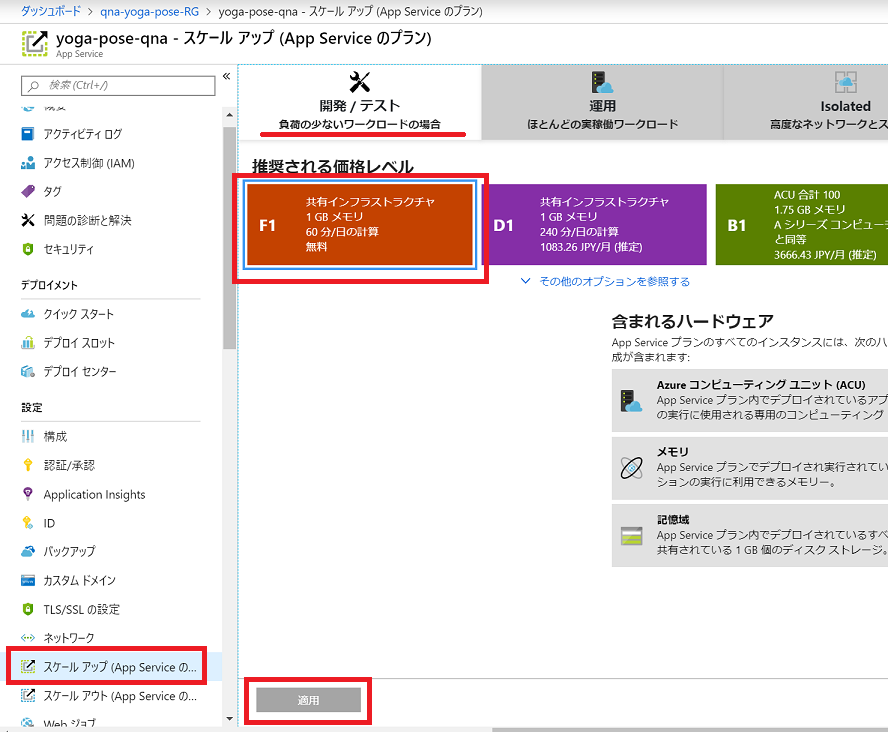

# Q&A をコーディングなしで Bot 化！ Cognitive Services QnA Maker による Q&A Bot 作成

## FAQ サイト または リストからの Q&A Bot 作成

### 新規 Q&A Bot サービス の作成

QnA Maker のページ( https://www.qnamaker.ai/ )にアクセスし、上部バーの [Create a knowledge base] をクリックし、ナレッジベースを作成します。


&nbsp;

#### STEP1

[Create a QnA service] をクリックすると Azure Portal のページに移動し、QnA Maker のリソースの作成画面が表示されます。


&nbsp;

Azure Portal の QnA Maker のリソースの作成画面で以下を参考に情報を入力します。

* **Name**：任意の名前を入力
* **サブスクリプション**：（自動入力）
* **Management pricing tier**：F0（無料版）
* **Resource group**：新規作成 or 既に作成済みの任意のグループを選択
* **Search pricing tier**：F（無料版）
* **Search location**：お好みの Azure データセンターの拠点を選択
* **App name**：任意の名前（Name の値が自動で入力されます）
* **Website location**：お好みの Azure データセンターの拠点を選択
* **App insights**：Enable
* **App insights location**：お好みの Azure データセンターの拠点を選択

[作成] をクリックすると、サービスが作成されます。Azure Portal の右上の通知でリソースの作成が完了するまで少々お待ちください。


&nbsp;

> リソースの完了後、作成したリソースグループを開きましょう。**App Service** のリソースがあるのでクリックし、**スケールアップ** を開きます。プランを **開発/テスト** タブ > **F1** (無料プラン) をクリックし、**適用** ボタンをクリックして変更しておくことをお勧めします。
> 

&nbsp;

#### STEP2

Azure Portal で Qna Maker の作成が完了したら、QnA Maker の [Create a knowledge base] ページにもどり、STEP2 で以下の情報を入力します。
※Qna Maker の作成完了は Azure Portal の画面右上に通知で表示されます。
※QnA Maker のページをリロードすると作成した Qna Maker が選択できるようになります。

* Microsoft Azure Directory ID：ご利用の ID
* Azure subscription name：ご利用のサブスクリプション
* Azure QnA service：作成した Qna Maker


&nbsp;

#### STEP3

ナレッジベースに名前をつけます。任意の名前を入力します。


&nbsp;

#### STEP4

QnA Maker に FAQ データを追加します。

まずFAQのデータを[こちらをクリックして](https://github.com/beachside-project/qna-maker-hands-on/raw/master/qna-data-source.zip)ダウンロードします。zip をデスクトップなどのわかりやすい場所に解凍します。

QnA Maker の画面に戻り、STEP4 の**File name** の下にある [Add] をクリックして、解凍したファイル `qna-data-source.tsv` をアップロードします。このファイルは、ヨガのポーズ名と、ポーズの特徴を説明したQAペアとなります。


&nbsp;

#### STEP5

「Create your KB」をクリックしナレッジベースを作成します。


&nbsp;

ナレッジベースの作成が完了すると、ナレッジベースの編集ページが開きます。ナレッジベース編集画面では QA の編集や、追加、削除を行うことができます。


&nbsp;

STEP4 で入力したデータが取り込まれていることを確認します。画面右上の[Save and train]をクリックし、編集内容を保存し、QnA Maker モデルのトレーニングを行います。

## Q&A のテスト

画面右上の[← Test]をクリックすると、QA のテスト用のページが表示され、実際の QnA Maker の動作を確認できます。想定された質問を入力すると、ナレッジベースから適切な答えを Bot が返答します。


&nbsp;

[Inspect]をクリックすることで Bot の回答の詳細を確認することができます。


&nbsp;

## QnA Maker の Web API 公開

[PUBLISH]をクリックすることでナレッジベースを Web API として公開することができます。


&nbsp;


&nbsp;

QnA Maker サービスが正常に公開されると作成した QnA Maker のエンドポイントが表示されます。塗りつぶしている部分は、セキュアな情報となります。

- `POST /knowledgebases/` の以降で塗りつぶされている部分は、**KB ID** となります。


&nbsp;

## オプション: POSTMAN を使って API にアクセス

※ ハンズオンのオプションコンテンツとして、興味がある方はチャレンジしてみてください。

POSTMAN は、REST のリクエストを送信するためのクライアントです。POSTMAN を使って QnA Maker で公開した Web API にアクセスしてみましょう。

> POSTMAN は[こちら](https://www.getpostman.com/downloads/)からダウンロードし無償でも利用が可能です。

POSTMAN を起動し、以下を参考に入力します。

- メソッドを **POST** に変更
- URLは、"QnA Maker の Web API 公開" のステップで確認できた **Host** と POST以降のパス（`/knowledgebases/******/generateAnswer` ）を入力
- [Header] をクリックし2つを入力
  - Key: **Authorization**, Value: Authorization: EndpointKeyの値を入力
  - Key: **Content-Type**, Value: **application/json**
- [Body] タブをクリック > [raw] をクリックし、以下のようにJSON フォーマットで質問を入力
  ```
  {"question": "ここに質問を入力", "top": 3}
  ```
  


&nbsp;

URLの左にある [Send] ボタンをクリックしましょう。入力に問題がなければ、以下図のように結果を取得することができます。


&nbsp;


## まとめ

質問＆回答のリスト、または FAQ などから Bot が容易に作れることが体感できましたでしょうか。

ご自身の業務等で活用をご検討して、業務をより効率的に行う手助けになれればと思います。

## NEXT STEP

QnA Maker をバックエンドとして、Azure Bot Service を利用し、Skype や Slack、Microsoft Teams など多くのチャンネルへ公開が可能です。

是非チャレンジしてみましょう。

* [Azure Bot Service](https://azure.microsoft.com/ja-jp/services/bot-service/)

* [参考ブログ：BOT 作成がより簡単に。Azure Bot Service による BOT アプリ作成＆公開](https://blogs.msdn.microsoft.com/bluesky/2016/11/16/how-to-create-publish-bot-using-azure-bot-service/)
